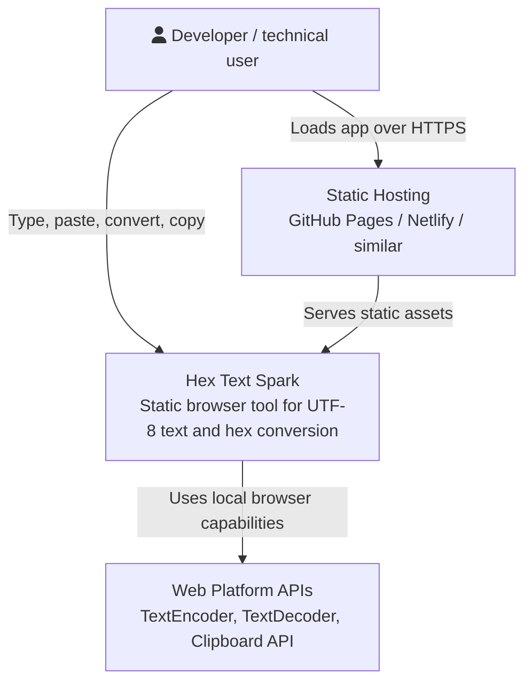
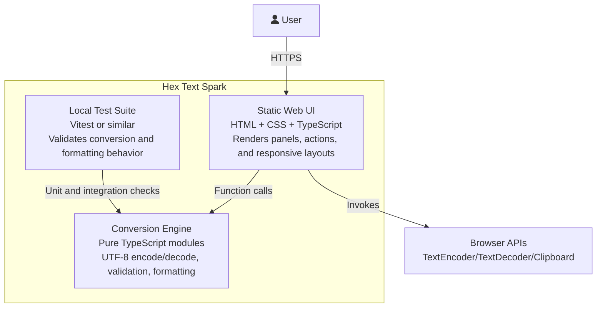
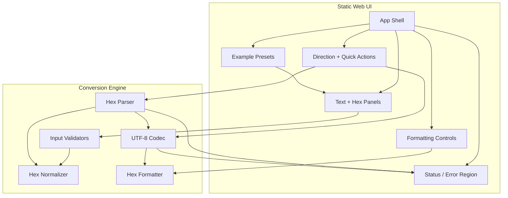
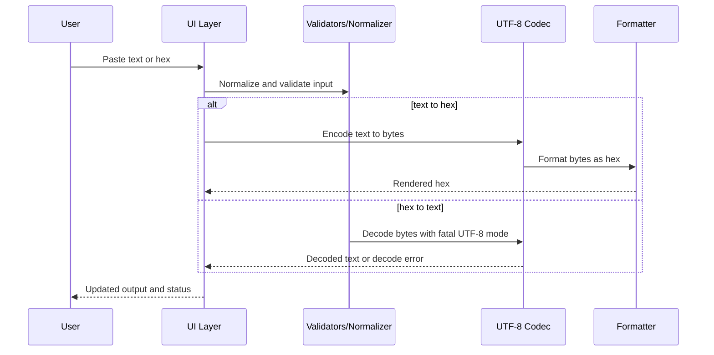

# C4 Architecture -- hex-text-spark-0606

## Level 1: System Context

## Level 2: Container Diagram

## Level 3: Component Diagram

## Integration Boundaries

- No application backend is required for the initial release.
- Conversion logic runs entirely inside the browser runtime.
- Clipboard access is the only user-agent integration beyond rendering and encoding APIs.
- Static hosting is a deployment concern only; it does not participate in conversion behavior.

## Runtime Flow

## Architectural Notes

- The conversion engine should remain framework-agnostic so it can be tested without DOM coupling.
- Parsing, decode, and formatting concerns should stay separate to keep validation failures precise.
- The UI state model should preserve raw input and rendered output independently to avoid destructive formatting side effects.
