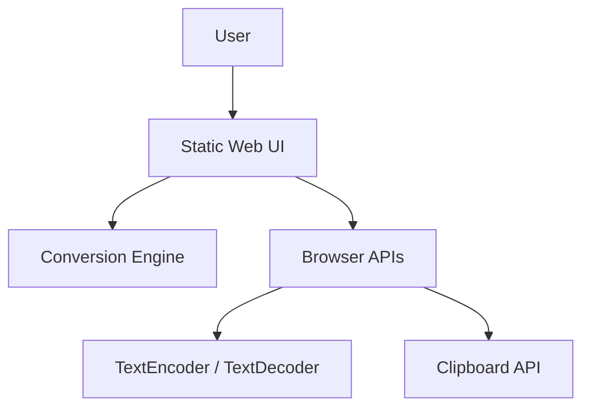

# Executive Brief -- hex-text-spark-0606

> **Status:** Awaiting approval
> **Autonomy level:** Standard
> **Created:** 2026-04-06
> **Project type:** Static web utility
> **Project traits:** browser-first, UTF-8 aware, responsive, lightweight

## What We Think You Want

Build a polished static browser tool that converts between plain text and hexadecimal encoding without relying on a backend. The tool needs to handle real UTF-8 text, make invalid input obvious, support formatting and copy/paste-heavy workflows, and feel complete on both desktop and mobile while staying lightweight and testable.

## What We Will Build

- A single-screen web utility for `Text -> Hex` and `Hex -> Text` conversion using browser-native UTF-8 APIs
- Visible formatting controls for hex case and spacing/grouping plus quick actions for copy, clear, swap, and examples
- Explicit validation and error handling for malformed hex input and invalid UTF-8 byte sequences
- A static, locally testable implementation suitable for simple deployment

## Key Screen Preview

  

    <b>Hex Text Spark</b>
    Examples
  

  

    

      
Text panel

      

        
-&gt; Hex

        
-&gt; Text

        
Swap

      

      
Hex panel

    

    

      
Case

      
Spacing

      
Validation area

    

  

## What We Will NOT Build

- User accounts, saved history, or cloud persistence
- Non-UTF-8 encodings in the first release
- File upload workflows, public APIs, or multi-step transformation pipelines

## Main Scope

- In-browser UTF-8 encode/decode
- Hex input normalization for whitespace
- Explicit parse and decode error states
- Hex formatting controls
- Quick actions and examples
- Responsive mobile and desktop layout
- Local automated tests

## Top Risks

| Risk | Impact | Mitigation |
|------|--------|-----------|
| Ambiguous hex parsing rules create user mistrust | Users may think the tool changed their data | Define accepted input rules explicitly and preserve raw input on error |
| Invalid UTF-8 handling gets implemented permissively | The tool may silently show misleading output | Use fatal decode behavior and separate parse vs decode messages |
| Responsive layout hides critical actions on small screens | Mobile workflow degrades despite nominal support | Keep all primary actions in the first viewport and validate against 375px layouts |

## Recommended Approach

Use a lightweight static frontend, ideally HTML/CSS/TypeScript with a small build tool such as Vite, and isolate the conversion engine into pure functions backed by browser-native encoding APIs. This keeps deployment simple, preserves privacy by doing all work locally, and gives the project a clean seam for automated tests without adding unnecessary framework or backend complexity.

## Post-Approval Implementation Decomposition

These are decomposition targets only, not implementation issues yet:

1. Build and test the conversion engine for `REQ-001`, `REQ-002`, `REQ-003`, `REQ-007`.
2. Implement hex formatting controls for `REQ-004`.
3. Implement main-screen actions and example presets for `REQ-005`.
4. Deliver responsive and accessible UI behavior for `REQ-006`, `NFR-003`, `NFR-004`.
5. Verify static deployment and automated tests for `REQ-007`, `REQ-008`, `NFR-001`, `NFR-002`, `NFR-005`, `NFR-006`.

## Estimated Scope

- **Requirements:** 8 functional, 6 non-functional
- **Implementation slices after approval:** 5
- **Complexity:** Low to Medium
- **Estimated time:** 2 to 4 focused development days

## Detailed Docs

- [Research -- Knowledge Tree](../research/knowledge-tree.md)
- [Product Requirements (PRD)](../prd/project-prd.md)
- [UX Specification](../ux/ux-spec.md)
- [Architecture (C4)](../architecture/c4.md)
