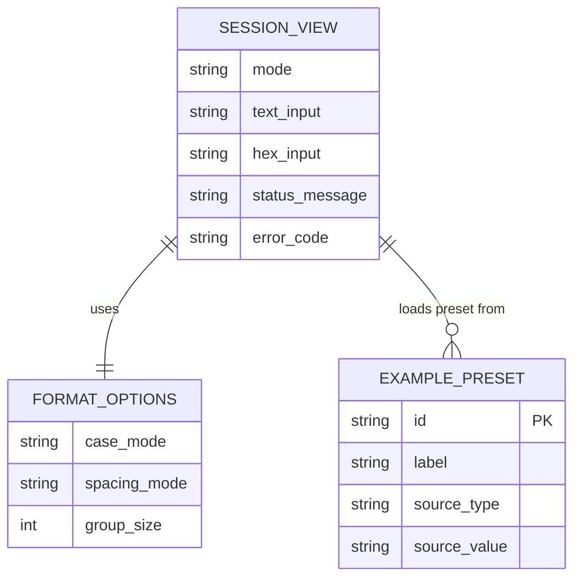

# Product Requirements -- hex-text-spark-0606

## Overview

Hex Text Spark is a polished static web tool that converts between plain UTF-8 text and hexadecimal byte sequences directly in the browser. It is designed for users who need fast, trustworthy conversion with strong formatting controls, clear validation, and copy/paste-friendly workflows on both desktop and mobile.

## Goals

1. Enable accurate text-to-hex and hex-to-text conversion for normal UTF-8 input entirely in-browser.
2. Make malformed input easy to detect and understand through explicit validation and error messaging.
3. Deliver a fast, responsive utility workflow with lightweight deployment and local automated test coverage.

## Non-Goals

- User accounts, cloud sync, or saved history across sessions.
- Support for arbitrary encodings beyond UTF-8 in the initial release.
- Bulk file upload, API access, or multi-tool transformation chains.

## User Stories

### Developer / Technical User

- **REQ-001** As a technical user, I want to convert plain text to hexadecimal instantly so that I can inspect exact byte output without leaving the browser.
  - Acceptance criteria:
    - [ ] When I enter UTF-8 text, the app renders the corresponding hex output without a network call.
    - [ ] Multi-byte characters such as `€`, `你好`, and `🙂` produce valid UTF-8 byte sequences.
    - [ ] Empty text input produces an empty output state rather than a misleading error.

- **REQ-002** As a technical user, I want to convert hexadecimal into text so that I can inspect encoded payloads quickly.
  - Acceptance criteria:
    - [ ] The app accepts hex input containing optional spaces and line breaks.
    - [ ] Valid hex input decodes into UTF-8 text in-browser.
    - [ ] An odd number of hex characters is rejected with a specific validation message.

- **REQ-003** As a technical user, I want malformed hex and malformed UTF-8 to fail clearly so that I can trust the tool’s output.
  - Acceptance criteria:
    - [ ] Any non-hex character other than allowed whitespace is rejected before decode.
    - [ ] Invalid UTF-8 byte sequences produce an error state rather than silently inserting replacement characters.
    - [ ] Error messaging identifies whether the failure came from hex parsing or UTF-8 decoding.

- **REQ-004** As a technical user, I want to control hex formatting so that the output matches the system or document I need to paste into.
  - Acceptance criteria:
    - [ ] I can switch between lowercase and uppercase hex output.
    - [ ] I can choose between no spacing, byte spacing, and grouped spacing.
    - [ ] Changing formatting does not alter the underlying byte content.

### Frequent Clipboard User

- **REQ-005** As a clipboard-heavy user, I want quick actions for copy, clear, swap, and example loading so that repeated conversions take only a few taps or clicks.
  - Acceptance criteria:
    - [ ] Copy actions exist for both text and hex panels and confirm success or failure.
    - [ ] A swap action exchanges current text and hex values only when the current state is convertible.
    - [ ] Clear actions reset content, validation state, and status messaging.
    - [ ] At least three example presets are available from the main screen.

- **REQ-006** As a user moving between devices, I want the same primary workflow on mobile and desktop so that the tool remains usable on a phone.
  - Acceptance criteria:
    - [ ] On desktop, both conversion panels are visible without mode switching at widths of 1024px and above.
    - [ ] On mobile widths of 375px and above, the main actions remain reachable without horizontal scrolling.
    - [ ] Error messages, examples, and formatting controls remain understandable and tappable on touch screens.

### Project Maintainer

- **REQ-007** As a maintainer, I want a lightweight static implementation so that deployment stays simple and low-cost.
  - Acceptance criteria:
    - [ ] The shipped app can be hosted as static assets without a backend service.
    - [ ] Core conversion logic is isolated into testable units separate from rendering code.
    - [ ] The project includes local automated tests for conversion, validation, and formatting behavior.

- **REQ-008** As a maintainer, I want the product scope to stay narrow so that the first release ships as a polished utility instead of a half-built toolkit.
  - Acceptance criteria:
    - [ ] The release scope is limited to UTF-8 text/hex conversion, formatting controls, examples, and workflow actions.
    - [ ] No account, persistence, or external integration dependency is required for the first release.
    - [ ] Planning and implementation decomposition map directly back to the numbered requirements in this document.

## Non-Functional Requirements

| ID | Requirement | Target | How to Verify |
|----|-------------|--------|---------------|
| NFR-001 | Static deployability | App runs as static assets with no runtime server dependency | Build output inspection and local static preview |
| NFR-002 | Performance | First interaction available within 2 seconds on a throttled mid-tier mobile profile for the main screen | Lighthouse or browser performance audit |
| NFR-003 | Accessibility | Keyboard-operable controls, visible focus states, semantic labels, and color contrast meeting WCAG AA | Manual keyboard pass plus automated accessibility scan |
| NFR-004 | Mobile support | Fully usable at 375px width and above with no horizontal overflow on primary screens | Responsive manual QA across target viewports |
| NFR-005 | Reliability | Zero uncaught runtime errors during core conversion flows in supported browsers | Automated tests plus browser console review |
| NFR-006 | Privacy | No user input is transmitted off-device during conversion | Network inspection during conversion flows |

## Data Model

## Functional Notes

- Text input is interpreted as UTF-8 source text before encoding to bytes.
- Hex input normalization removes spaces, tabs, and line breaks only.
- Hex decoding requires an even number of normalized hex characters.
- UTF-8 decoding uses fatal error semantics to avoid silent byte repair.
- Formatting controls affect rendered hex output only, not the byte array.

## Implementation Decomposition Preconditions

Post-approval implementation work should be decomposed into a small set of requirement-linked workstreams:

1. Conversion engine and validators: `REQ-001`, `REQ-002`, `REQ-003`, `REQ-007`
2. Formatting model and output rendering: `REQ-004`
3. Main screen interactions and examples: `REQ-005`, `REQ-006`
4. Responsive polish and accessibility pass: `REQ-006`, `NFR-003`, `NFR-004`
5. Automated tests and static build verification: `REQ-007`, `REQ-008`, `NFR-001`, `NFR-002`, `NFR-005`, `NFR-006`
