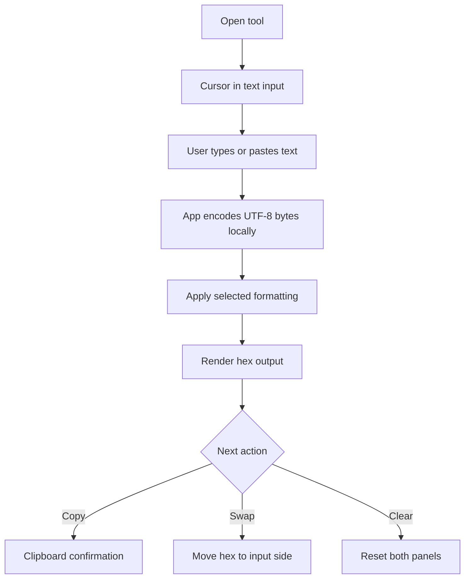
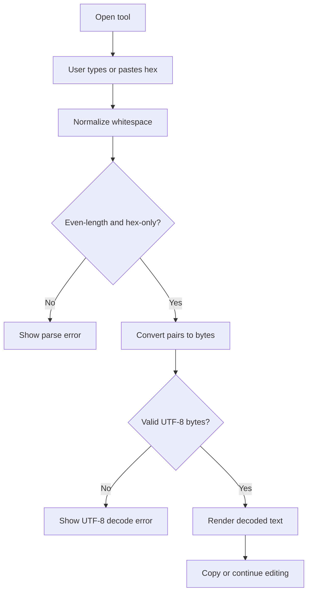
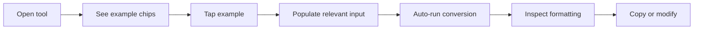

# UX Specification -- hex-text-spark-0606

## Experience Principles

- Keep the primary job visible: enter text, see hex; enter hex, see text.
- Make byte-level trust visible through explicit validation and exact formatting controls.
- Optimize for paste-heavy usage before decorative complexity.
- Preserve parity between desktop and mobile without hiding essential controls.

## User Flows

### Flow 1: Text to Hex Conversion

### Flow 2: Hex to Text Conversion With Validation

### Flow 3: Example-Led First Use

## Key Screens

### Main Converter Screen

**Purpose:** Provide the full conversion workflow on a single screen with paired text and hex panels, formatting controls, quick actions, and examples.
**Entry points:** Root URL, bookmarked utility link, shared internal tools page.
**Key elements:**
- Text input panel with label, helper text, character count, clear button, and copy action
- Hex input/output panel with label, helper text, byte count, clear button, and copy action
- Direction controls: `Text -> Hex`, `Hex -> Text`, and `Swap`
- Formatting controls: case selector and spacing/grouping selector
- Example preset chips for ASCII, multilingual UTF-8, and invalid-input demonstration
- Inline status area for success, validation errors, and clipboard outcomes

**States:**
- **Loading:** Minimal shell only if app assets are still booting; no spinner once hydrated because the app is local and fast.
- **Empty:** Empty text and hex panels, example chips visible, helper copy explains accepted input and formatting options.
- **Error:** Inline message anchored near the affected panel; message explains invalid hex, odd length, or invalid UTF-8 bytes without clearing user input.
- **Populated:** Both panels visible with counts, active formatting controls, and quick actions ready.

**Accessibility notes:**
- All icon-only actions require visible text labels or accessible names.
- Direction and formatting controls must be reachable by keyboard in a logical tab order.
- Status messaging should use an `aria-live` region for conversion and clipboard feedback.
- Errors should be programmatically associated with the relevant input.

**Performance notes:**
- Conversion runs on each meaningful input change for typical utility-sized payloads.
- No network-bound UI states should block conversion.
- Large pasted inputs should not freeze typing; formatting should operate on normalized byte arrays efficiently.

**Wireframe:**

  

    <b>Hex Text Spark</b>
    Examples | About
  

  

    

      
Hello

      
UTF-8 sample

      
Invalid hex

    

    

      

        
Text

        
Type or paste UTF-8 text

        
23 charsCopy | Clear

      

      

        
Text -&gt; Hex

        
Hex -&gt; Text

        
Swap

      

      

        
Hex

        
48 65 6c 6c 6f

        
5 bytesCopy | Clear

      

    

    

      
Case: lowercase / UPPERCASE

      
Spacing: none / byte / group-4

      
Error: invalid UTF-8 byte sequence

    

  

Mobile wireframe (375px+):

  

    <b>Hex Text Spark</b>
    Menu
  

  

    

      
Hello

      
UTF-8

      
Invalid

    

    

      
Text

      
Paste text

      
23 charsCopy

    

    

      
-&gt; Hex

      
-&gt; Text

      
Swap

    

    

      
Hex

      
48 65 6c 6c 6f

      
5 bytesCopy

    

    

      
Case selector

      
Spacing selector

      
Inline validation message

    

  

### Error-Forward State

**Purpose:** Keep malformed input visible while explaining why conversion failed and what the user can do next.
**Entry points:** Invalid hex characters, odd-length hex input, malformed UTF-8 bytes, clipboard failure.
**Key elements:**
- Error summary line near the affected panel
- Input preserved exactly as entered
- Suggested corrective action
- Retry-capable action buttons still available where safe

**States:**
- **Loading:** Not applicable; errors should render synchronously with user input.
- **Empty:** Not shown.
- **Error:** Red-accented inline box with specific cause and no destructive auto-clearing.
- **Populated:** Error box disappears as soon as input becomes valid.

**Accessibility notes:**
- Error text must not rely on color alone.
- Screen readers should receive the updated error through an `aria-live="polite"` region.
- Focus remains in the edited field after validation feedback appears.

**Performance notes:**
- Validation should trigger in the same interaction loop as conversion and avoid layout jumps.
- Error-state rendering should not reflow the entire page on mobile.

**Wireframe:**

  

    
Hex input

    
48 65 6C 6Z

    

      Invalid hex character detected at position 8. Allowed input: 0-9, A-F, a-f, spaces, and line breaks.
    

    

      Fix input and retry
      Clear
    

  

Mobile wireframe (375px+):

  

    
Hex input

    
48 65 6C 6Z

    

      Invalid hex character at byte 4.
    

    

      Edit
      Clear
    

  

## Interaction Details

- Conversion mode can be implicit from the last active panel or explicit via direction buttons; direction buttons are preferred because they remove ambiguity.
- `Swap` is enabled only when the currently rendered output is valid and can become the next input.
- Formatting controls apply to the hex panel regardless of whether hex is source input or rendered output.
- Example presets should include:
  - `Hello` for simple ASCII
  - `こんにちは` or `你好` for visible UTF-8 multi-byte behavior
  - An invalid hex example to demonstrate validation rules
- Copy success should show lightweight confirmation without modal interruption.
- Clipboard failure should provide manual fallback guidance such as "Select and copy manually."

## Content Notes

- Use plain labels: `Text`, `Hex`, `Copy`, `Clear`, `Swap`, `Uppercase`, `Byte spacing`.
- Helper copy should say that spaces and line breaks are allowed in hex input.
- Error messages should avoid vague phrasing like "conversion failed"; they should name the failure class.
